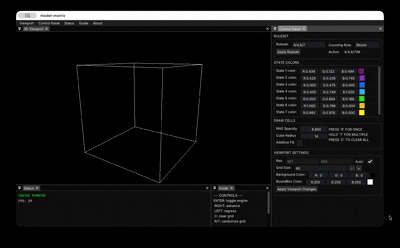

# Model Matrix

---

###  Overview
This is an effort to build an open-source 3D Cellular Automata engine in C++ with raylib. This program
is intended to build upon [previous work](https://github.com/gjinrexhaj/cellular-automata) I've done regarding Cellular Automata.

Currently, this program is able to simulate any user-specified 3D CA ruleset with the following features:
- Customizable live environment and simulation ruleset
- Customizable colors for each cell stat
- Cell clearing and random generation
- Zoom/pannable 3D viewport

GitHub serves as this project's primary platform for code, and collaboration.



### RULESET GUIDE

Similar to their 2D counterparts, 3D Cellular Automata uses one or more numerical values to determine the
survival and birth conditions respectively. 

Take the following ruleset as an example:
```
3/4/7
```
This states that an alive cell will survive if it has exactly three alive neighbors, and an empty cell will become alive if
it has exactly four alive neighbors. The third number defines that maximum state that a cell can have. In this example, when a cell is alive,
it has state 7. If that cell is then marked for death (when it fails the survival condition), it will tick down until it reaches
state 0, where it becomes an empty cell. Cells that are actively dying do not count as alive neighbors.

Each condition (except for maximum state) can have multiple values, which can be achieved by separating them via comma. 
For example, this following ruleset is valid:
```
3,4/4,7/8
```

3D Cellular Automata differs from the traditional 2D approach by introducing another dimension, which warrants the addition
of another parameter: The neighbor counting rule. The two most common are Moore and Von Neumann. Moore neighbor counting includes 
all possible neighbors that intersect the cells' vertices, whereas Von Neumann counting only considers neighbors where that
the faces of the cell intersect. The neighbor counting rule can be chosen from a drop-down menu.

---

## Table of Contents
1. [Project Goals](#project-goals)
2. [Repository Structure](#repository-structure)
3. [Tech Stack](#tech-stack)
4. [Git Conventions](#git-conventions)
    - [Branching](#branching)
    - [Commits](#commits)
    - [Pull Requests](#pull-requests)
    - [Code Style](#code-style)
5. [Getting Started](#getting-started)
6. [Contribute](#contribute)
7. [Contributors](#contributors)

---

## Project Goals
- Implement an application which allows for the simulation of various forms of 3D Cellular Automata
- Expose most simulation parameters to make it highly customizable

---

## Source Structure
This project uses a flat structure, that is, all app-specific implementation and header files are located within the src/ directory.

---

## Tech Stack
We'll be using the following tools to develop, test, and debug this program:

- **Programming Language:** [C++](https://en.wikipedia.org/wiki/C%2B%2B)
- **Graphics:** [raylib](https://www.raylib.com/)
- **GUI:** [Dear ImGui](https://github.com/ocornut/imgui)
- **Build System Generator:** [CMake](https://cmake.org/)
- **Debugger:** [LLDB](https://lldb.llvm.org/), or GDB

---

## Git Conventions
To keep our work organized and manageable, we'll adhere to these conventions:

### **Branching**
- **`main` branch:** Stable and working code only
- **Feature branches (`feature/<name>`):** For new features
- **Bugfix branches (`bugfix/<name>`):** For retroactively resolving issues

### **Commits**
To keep things nice and organized, please prepend a relevant **type** seen
in the table below to your commit message.

Example:  ```feat(gui): Implement neural vetwork visualizer```

| Type      | Purpose |
|-----------|---------|
| **feat**  | Introduces a new feature |
| **fix**   | Fixes a bug |
| **chore** | Maintenance tasks |
| **docs**  | Documentation changes |
| **style** | Formatting, whitespace, missing semicolons, etc. |
| **refactor** | Code restructuring without changing behavior |
| **test**  | Adding or updating tests |
| **perf**  | Performance improvements |
| **build** | Changes to build scripts, dependencies |


### **Pull Requests**
- Always create a PR before merging into `main`.
- PRs should be reviewed.
- Include a description of what the PR does.
- Run tests before submitting a PR.

---

## Getting Started

### **Prerequisites**
This project was created with CLion, but any proper C/C++ development environment should suffice.


### **Procedure**

The following steps are outlined using CLI tools to provide an environment-agnostic
guide to setting this project up. If you want to avoid using the below CLI commands, most
modern IDEs ship with their own respective GUI tools that achieve the same thing. For instance,
CLion users can follow [this reference](https://www.jetbrains.com/help/idea/using-git-integration.html), it's targeted towards IntelliJ,
but the procedure is almost the exact same for CLion.

1. **Clone the repository:**
```shell
  git clone https://github.com/gjinrexhaj/model-matrix.git
```
3. **Create a feature branch before working on a new task:**
```shell
  git checkout -b feature/<your-feature-name>
```
4. **Commit changes regularly:**
```shell
   git add <changed-files>
   git commit -m "(Type): Message")>
```
5. **Push your branch and create a pull request:**
```shell
   git push origin feature/<your-feature-name>
```

---

## Contribute
To keep our project organized and productive, please:
- **Open an Issue Before Major Changes**
- **Follow Coding Standards:** Keep naming and formatting consistent, avoid creating spaghetti-code when possible
- **Test Your Code Thoroughly:** Make sure it works before merging.
- **Review PRs:** Look for clarity, correctness, and efficiency.

---

## Contributors
<a href="https://github.com/gjinrexhaj"></a>